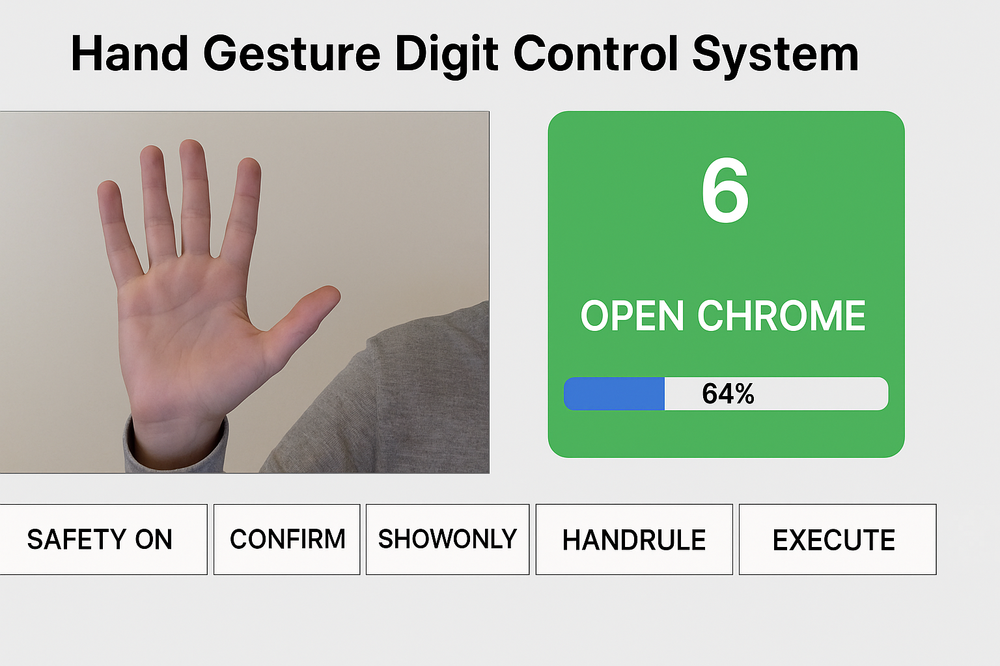
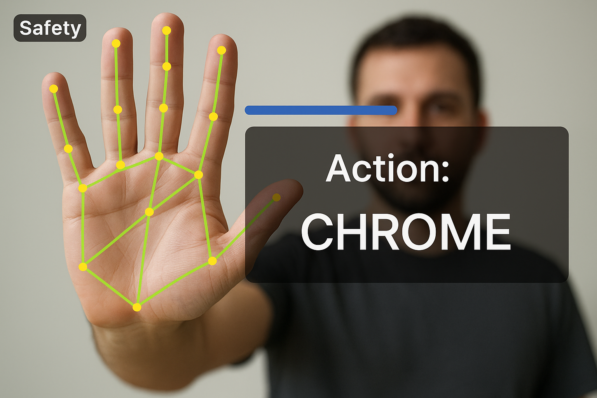

# 🖐 Hand Gesture Digit Control System 🚀

A real-time computer-vision system that recognizes hand-sign digits (1–10) using MediaPipe Hands and a lightweight SVM model, then maps each gesture to a Windows system action such as volume control, switching desktops, or opening Chrome.

The project combines deep feature extraction (via MediaPipe CNN) with classical machine learning (SVM) for fast, CPU-based gesture control.






# ✨ Key Features

Real-time Gesture Recognition: Tracks hand landmarks from webcam using MediaPipe.

Dual-Hand Support: Right hand → digits 1–5, Left hand → digits 6–10.

Smart Stability: EMA filtering, confidence hysteresis, dwell confirmation, and cooldown logic prevent false triggers.

Action Mapping: Each gesture triggers a unique Windows function (volume, explorer, chrome, etc.).

Interactive HUD: On-screen progress bar and target badge showing detected gesture, confidence, and action name.

Safety Controls: On-screen toggles (Safety, Confirm, ShowOnly, HandRule, Execute).

# 🧠 System Architecture
```txt
[Webcam RGB Frame]
        ↓
[MediaPipe Hands (Deep CNN) → 21 Landmarks]
        ↓
[Feature Engineering (102D vector)]
        ↓
[StandardScaler + SVM (RBF)]
        ↓
[Gesture Class (1–10)]
        ↓
[Action Mapping Layer (Windows API + pyautogui)]
```
Deep Learning Used:
MediaPipe Hands internally uses a CNN to extract hand landmarks.
The SVM model is trained on those deep features for gesture classification.

# 📊 Gesture → Action Mapping
| Digit |  Hand | Action             |
| :---: | :---: | :----------------- |
|   1   | Right | Volume Up          |
|   2   | Right | Volume Down        |
|   3   | Right | Switch Desktop     |
|   4   | Right | Snipping Tool      |
|   5   | Right | Open File Explorer |
|   6   |  Left | Open Chrome        |
|   7   |  Left | Mute / Unmute      |
|   8   |  Left | Lock Screen        |
|   9   |  Left | Minimize All       |
|   10  |  Left | Show Desktop       |

# 🛠 Installation & Setup
Prerequisites

-  Python 3.8 or higher

-  Windows OS (for system actions)

-  Webcam

## Required Libraries

Create requirements.txt:
```txt
Prerequisites

Python 3.8 or higher

Windows OS (for system actions)

Webcam

Required Libraries

Create requirements.txt:
```
Install dependencies:
```txt
pip install -r requirements.txt
```
# ▶️ Running the Application
Place the trained model files in your project folder:
```txt
model_digits_svm.pkl
scaler_digits.pkl
sign_digits_user.npz
```
Run the main notebook or Python file:
```txt
Run the main notebook or Python file:
```
Use your webcam to show hand digits 1–10.

Hold a gesture steady until the progress bar fills.

Press Enter or click EXECUTE to trigger the mapped system action.

# 📂 Project Structure
```txt
.
├── gesture_control.py          # Main application script
├── sign_digits_user.npz        # Collected training dataset
├── model_digits_svm.pkl        # Trained SVM model
├── scaler_digits.pkl           # StandardScaler object
├── Untitled.ipynb              # Jupyter notebook (data collection & training)
├── requirements.txt            # Dependencies list
└── README.md                   # Project documentation
```
# 🔍 Technical Details
Feature Vector: 102D
(42 XY coordinates + 55 pairwise distances + 5 finger angles)

Model: SVM with RBF kernel (C=5.0, gamma='scale', probability=True)

Stabilization:

EMA_ALPHA = 0.45

TEMP = 0.7

CONF_ENTER = 0.70, CONF_EXIT = 0.55

DWELL_MS = 650, COOLDOWN_S = 0.8

# 🧩 Future Improvements
Replace SVM with MLP (deep model) for end-to-end learning.

Add gesture sequences (e.g., swipe, rotate).

Add GNN for hand-skeleton modeling.

Support for Linux/macOS actions.

JSON config for customizable mappings.

# 📜 License

This project is licensed under the Apache License.
